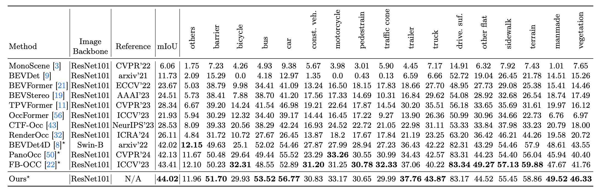

<p align="center">
  <h1 align="center">OctreeOcc: Efficient and Multi-Granularity Occupancy Prediction Using Octree Queries</h1>
  <p align="center">
    <a href="https://yuhanglu2000.github.io">Yuhang Lu</a>,
    <a href="https://xingezhu.me">Xinge Zhu</a>,
    <a href="https://tai-wang.github.io">Tai Wang</a>,
    <a href="https://yuexinma.me/aboutme.html">Yuexin Ma</a>
  </p>
  <p align="center">
    <a href="https://arxiv.org/pdf/2312.03774.pdf"><strong>Paper</strong></a>
  </p>
</p>

## Main Idea

<p align="center">
  
</p>

OctreeOcc employs octree queries to offer varying granularity for distinct semantic regions, thereby diminishing the requisite number of queries for modeling and mitigating the issue of low information density in 3D space.

## Architecture Overview

<p align="center">
  
</p>

Given multi-view images, we extract multi-scale image features utilizing an image backbone. Subsequently, the initial octree structure is derived through image segmentation priors, and the transformation of dense queries into octree queries is effected. Following this, we concomitantly refine octree queries and rectify the octree structure through the octree encoder. Finally, we decode from the octree query and obtain occupancy prediction outcomes for this frame. For better visualisation, the diagram of Iterative Structure Rectification module shows octree query and mask in 2D form (quadtree).

## Performance

<p align="center">
  
</p>

<p align="center">
  
</p>

Experiments conducted on the Occ3D-nuScenes dataset demonstrate that our approach enhances performance while substantially decreasing computational overhead (even when compared to 2D modeling approaches).

## Visualization

<p align="center">
  
</p>

Qualitative results on Occ3D-nuScenes validation set. The first row displays input multi-view images, while the second row showcases the occupancy prediction results of PanoOcc, FBOCC, our methods, and the ground truth.

## Coming Soon

- Detailed guidance documents
- Data generation scripts

Stay tuned for updates. Thank you for your interest in our work!


## Citation
```
@article{lu2024octreeocc,
  title={Octreeocc: Efficient and multi-granularity occupancy prediction using octree queries},
  author={Lu, Yuhang and Zhu, Xinge and Wang, Tai and Ma, Yuexin},
  journal={Advances in Neural Information Processing Systems},
  volume={37},
  pages={79618--79641},
  year={2024}
}
```
